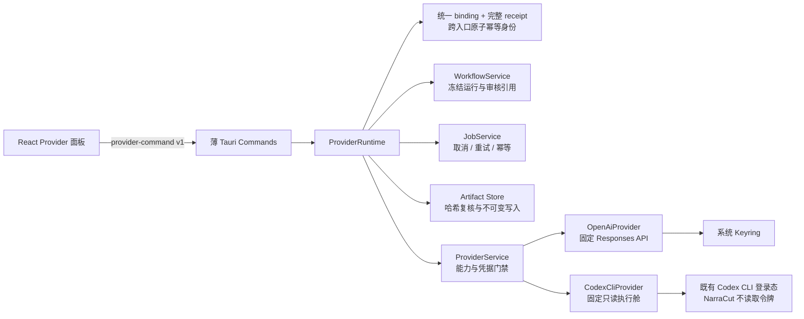
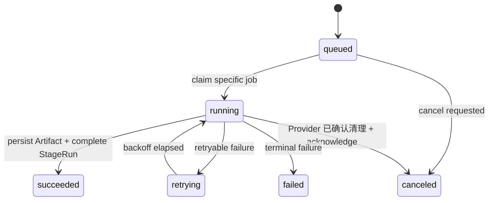

# AI Provider v1 与结构化脚本阶段

PR08 建立 NarraCut 第一条可执行 AI 链路，PR09 在同一接口后加入本机 Codex CLI：两种实现都只读取
已经审核采用的创作简报、事实主张与证据，生成带追溯关系的结构化脚本，并把完整结果保存为不可变 Artifact。
它不是“任意提示词代理”，也不会让前端获得网络端点、请求头或 shell 权限。

## 1. 责任边界



| 层 | 可以做什么 | 明确不能做什么 |
| --- | --- | --- |
| React | 查看 Provider/模型、配置或删除密钥、提交脚本任务、显示诊断 | 读取密钥、拼接 HTTP、执行 shell、伪造 Job 事件 |
| Tauri command | 校验版本化消息并调用高层操作 | 接受任意 endpoint、header、prompt 或命令行参数 |
| ProviderRuntime | 冻结审核输入、调度任务、保存结果、响应取消 | 从原始资料重新自由总结、覆盖历史 StageRun/Artifact |
| ProviderService | 校验能力、读取瞬时 Secret、执行统一接口、验证响应身份 | 序列化或记录 Secret |
| OpenAiProvider | 向固定 Responses endpoint 发送严格结构化请求并统计用量 | 兼容任意网关、透传供应商私有响应、降低输出 Schema 约束 |
| CodexCliProvider | 探测固定 CLI 能力，在隔离目录直接启动受限 `codex exec`，解析有界 JSONL | 接受用户 flags、调用 shell、读取/复制登录令牌、把真实项目目录交给 CLI |

## 2. Provider v1 契约

权威来源是
[`packages/contracts/schema/narracut-provider-v1.schema.json`](../packages/contracts/schema/narracut-provider-v1.schema.json)。
TypeScript 类型生成到 `packages/contracts/src/generated/provider-v1.ts`；Rust 在编译期从同一
Schema 生成类型，并在所有跨边界消息反序列化前执行 Draft 2020-12 校验。

| 消息组 | 消息 |
| --- | --- |
| 发现 | `get_provider_catalog_request`、`provider_catalog_result` |
| 凭据 | `get_provider_credential_status_request`、`set_provider_credential_request`、`delete_provider_credential_request` 与状态/变更结果 |
| 脚本入队 | `script_stage_enqueue_request`、`script_stage_enqueue_result` |
| Provider 执行 | `provider_request`、`provider_event`、`provider_result` |
| 失败 | `provider_command_error`，使用稳定 code、operation 与 retryable 标记 |

UI 只调用以下高层、带类型的 Tauri commands：

| Command | 输入范围 | 返回 |
| --- | --- | --- |
| `get_provider_catalog` | 固定 v1 消息 | Provider、模型与结构化输出能力 |
| `get_provider_credential_status` | `providerId` | 远程 API 仅返回是否已配置；本地 CLI 返回安装、登录、版本与有界诊断，不返回 Secret |
| `set_provider_credential` | `providerId`、Secret | 保存状态；请求对象不进入项目持久化 |
| `delete_provider_credential` | `providerId` | 删除状态 |
| `enqueue_script_stage` | 项目身份、Provider/模型、run/idempotency、语言和 token 上限 | `jobId`、`runId`、请求身份和当前状态 |

`script_stage_enqueue_result.status` 与 Job 状态机一致，完整覆盖 `queued`、`running`、
`retrying`、`succeeded`、`failed` 和 `canceled`。幂等键已绑定另一份请求时返回稳定的
`idempotency_conflict`，不会降级成内部契约错误。

`ProviderCredentialStatus` 是按 `storage` 判别的联合类型：`system_keyring` 只允许远程 Secret 状态；
`none` 只用于本地运行时状态，并要求 `installed`、`loggedIn`、`versionSupported`、`diagnosticCode`
和 `diagnostic`。对 `local_codex` 调用设置或删除凭据会返回稳定的 `credential_unsupported`，不会访问 Keyring。

合法与非法消息夹具分别位于
`packages/contracts/fixtures/valid-provider-messages.json` 与
`packages/contracts/fixtures/invalid-provider-messages.json`。非法夹具覆盖附加字段、任意 endpoint/header/prompt、
越界 token、缺失追溯与不合法结果引用等情况。

## 3. 审核输入与追溯

脚本阶段不会读取未审核草稿，也不会从项目 `sources/` 任意扫描。入队时必须同时满足：

| 条件 | 运行时校验 |
| --- | --- |
| Research 当前可用 | `research` 为 `approved`，不是 `stale`，并指向当前 `approvedRunId` |
| 审核记录一致 | ReviewRecord 为 `approved`，且 run/stage/project 身份全部匹配 |
| 事实输入完整 | 批准集合分别至少包含一个可读取、哈希有效的 `claim_set` 与 `evidence_set` Artifact，不能用“某个产物带有 provenance”代替 kind 完整性 |
| 简报有来源 | 从 Research 的不可变输入引用中解析已审核 Brief Artifact，而不是读取当前可变状态 |
| 内容未被替换 | 读取前复核 Artifact 元数据、字节数、SHA-256 与项目身份 |
| 事实可追溯 | Provider 输入和脚本分段使用显式 `provenance: [{ claimId, evidenceRef }]`；输出采用的每一整对必须是审核输入对的子集，禁止把两个合法 ID 交叉重组为未审核关系 |

单个输入内容上限为 2 MiB，总读取上限为 8 MiB，输入数量必须为 2–32。Provider 请求携带
Artifact 身份、内容哈希、来源 StageRun、ReviewRecord 与精确 provenance 对；最终脚本 Artifact 原样汇总
脚本真正采用的 provenance 对，并保存完整 `provider_result`（包括 usage），不会根据两个独立 ID 集合推导关系。

## 4. Provider 级幂等与运行配置冻结

`enqueue_script_stage` 在读取当前凭据或 Research 状态之前，先与 generic 入队共同竞争
`requests/job-bindings/<jobId>.json`，再把完整、已通过 Provider v1 Schema 校验的 enqueue 请求
原子写入 `requests/jobs/<jobId>.json`。`jobId` 仍由 `projectId + idempotencyKey` 确定性推导；
binding 采用无覆盖提交并绑定 `request_receipt + 完整请求摘要`，因此 Provider 与 generic 并发时
也只有一个入口能取得该身份，失败方不能留下 receipt 或 JobDefinition。

| 场景 | 行为 |
| --- | --- |
| 同 key、同完整请求 | 读取既有 receipt；若运行快照或 Job 已存在，直接从冻结数据恢复/返回原 Job |
| 同 key、不同语言、token 上限或其他字段 | 在凭据、Research 检查和配置处理前返回 `idempotency_conflict` |
| receipt 已落盘、运行快照前崩溃 | 同一请求可重新执行首次只读门禁并继续冻结 |
| binding 已落盘、receipt 前崩溃 | 同一完整请求可继续写 receipt；generic 与不同请求稳定冲突 |
| 运行快照已落盘、JobDefinition 前崩溃 | 不再依赖当前凭据或 Research，使用冻结输入、配置和 executor 完成唯一 Job |
| Job 已是 `failed` / `canceled` | 精确重放返回原 `jobId` 与原终态，不创建新任务 |
| 升级前早期 legacy Job 已存在 | base hash 匹配后忽略 side receipt，并由不可变快照、executor 与配置重建完整请求；仅 exact replay 可附加 receipt |
| `2addb7a` 过渡 Job 已存在 | base hash 不匹配时才读取 receipt，并按完整 `enqueueRequest` 历史算法复核；exact replay 返回原 Job，错误或缺失 receipt 报完整性错误 |

语言和 token 上限作为本次运行的配置覆盖写入不可变 `StageExecutionSnapshot.configSnapshot`，
enqueue 不会隐式改写全局 `stages/script/config.json`。新 Job 显式写入 `requestHashVersion: 2`；使用
receipt 时，`requestReceiptHash` 绑定完整请求，Job `requestHash` 再覆盖该摘要、冻结 `inputRefs`、executor
与重试策略。receipt 文件存在性与内容哈希另行校验，不参与 v2 算法选择。缺少版本字段时先验证 base
legacy hash；只有不匹配时才读取 receipt 并尝试 `2addb7a` 的完整 `enqueueRequest` 算法。这样早期 legacy
的错误旁路 receipt 不会污染 `get/list/recover`，实际过渡 Job 也不会失读；不同语言、token、Provider 或
模型不能借升级重放抢占 receipt。

## 5. OpenAI Responses 适配器

当前 `openai_api` 适配器使用固定的 `https://api.openai.com/v1/responses`，请求由代码内受审模板构造：

- 任务固定为 `script_generation`；
- `instructions` 固定，不接受调用方自由 prompt；
- `text.format` 使用 strict JSON Schema；
- 发往 OpenAI 的 Schema 只使用 Structured Outputs 官方支持子集，不发送 `uniqueItems`；NarraCut 本地
  provider v1 Schema 仍用 `uniqueItems` 拒绝重复 provenance 对；
- 模型必须来自 Provider catalog 且声明支持结构化脚本；
- `max_output_tokens` 同时受 Provider 能力与 v1 Schema 约束；
- 解析 `output_text` 后再次校验 NarraCut `provider_result` 契约、请求身份和 provenance 整对子集；
- 保存 input/output/total tokens，不保存授权头或 Secret。

HTTP 适配器先按状态码分类，再决定是否读取和解析正文：429 直接映射为可重试 `rate_limited`，
5xx 映射为可重试 `provider_unavailable`，即使正文是 HTML、纯文本或损坏 JSON 也不会改变分类。
只有 2xx 成功正文进入最多 2 MiB 的有界读取与 JSON 解析；错误正文、授权头和完整不可信内容
不会进入诊断。该策略与 OpenAI 官方对 429、500、503 的重试建议一致。

参考官方资料：[Responses create](https://developers.openai.com/api/reference/resources/responses/methods/create)、
[Structured Outputs](https://developers.openai.com/api/docs/guides/structured-outputs) 与
[API errors](https://developers.openai.com/api/docs/guides/error-codes#api-errors)、
[API Key 安全建议](https://help.openai.com/en/articles/5112595-best-practices-for-api-key-safety)。

测试使用可注入 `ProviderHttpTransport` 的 Mock HTTP，不需要真实密钥，也不会访问网络。Mock 会断言
固定 URL、Bearer 头、strict JSON Schema、输出引用和 usage 映射；本地一次性 TCP server 另行回归
非 JSON 429/503 的状态优先分类。

## 6. 本机 Codex CLI 适配器

`local_codex` 与 `openai_api` 实现同一个 `AiProvider`，因此入队 receipt、冻结输入、Job 生命周期、
Artifact 写入和最终 `provider_result` 完全共用。差异只位于适配器内部：它的 transport 是 `local_cli`，
凭据策略是 `none`，不会读取 Keyring，也不会读取、复制或记录 Codex 的认证文件与令牌。

### 6.1 就绪探测与执行身份

| 探测 | 有界行为 | 状态 |
| --- | --- | --- |
| 可执行文件 | 按当前 `PATH` / Windows `PATHEXT` 查找，canonicalize 后只接受真实文件；Windows 只接受 `.exe` | `not_installed` / installed |
| 文件身份 | 流式计算 canonical executable 的 SHA-256 | `probe_failed` 或冻结 hash |
| 版本 | 直接执行 `codex --version`，只接受 `codex-cli <semver>`；当前窗口为 `>=0.144.0,<0.145.0` | `unsupported_version` / supported |
| 固定能力 | 直接执行 `codex exec --help`，确认 JSONL、ephemeral、忽略用户配置/规则、只读 sandbox、模型、输出 Schema 与工作目录参数存在 | `probe_failed` / supported |
| 登录 | 直接执行 `codex login status`，只看退出状态，不保存或回显 stdout/stderr | `not_logged_in` / ready |

每个探测最多 5 秒、每路输出最多 16 KiB。开发环境已验证 Codex CLI `0.144.1`，但实现并未把唯一
补丁版本硬编码为可用条件；升级兼容窗口必须伴随适配器与回归测试更新。

入队时把 `adapterVersion + cliVersion + executableHash` 冻结进 executor identity，并编码进既有
Job executor 版本字段。领取与真正 spawn 前再次探测；只要适配器版本、CLI 版本或可执行文件哈希漂移，
旧任务就以 `provider_unavailable` 停止，用户需要创建新任务冻结新身份，不能让恢复/重试静默换执行器。

### 6.2 固定命令、隔离执行舱与最小环境

适配器使用 Rust process API 直接启动已 canonicalize 的可执行文件，不经过 shell，也不接受 UI、项目、
配置文件或模型输出提供的 flags。命令形状固定为：

```text
codex exec
  -c features.shell_tool=false
  -c features.skill_mcp_dependency_install=false
  -c web_search="disabled"
  -c shell_environment_policy.inherit="none"
  -c tools.view_image=false
  --json --ephemeral --ignore-user-config --ignore-rules
  --sandbox read-only --color never --skip-git-repo-check
  --model <catalog 中冻结的模型>
  --output-schema <capsule/narracut-script-v1.schema.json>
  -C <capsule> -
```

| 边界 | 实现 |
| --- | --- |
| 工作目录 | 每次运行创建临时 capsule，不把真实项目目录、`.codex/` 或未审核资料暴露给 CLI |
| 文件内容 | capsule 只写共享输出 Schema；完整审核输入与冻结配置仅通过 stdin 传入，不落 capsule 文件 |
| 工具 | shell、skill/MCP 依赖安装、网页搜索、图片查看均由固定配置关闭；策略同时声明工具、网络与写文件禁止 |
| 环境 | `env_clear` 后只复制运行所需的固定 allowlist；显式不传 `ComSpec`、`OPENAI_API_KEY`、`CODEX_API_KEY`、`CODEX_ACCESS_TOKEN` 等令牌环境变量 |
| 输出 | stdout 只作为有界 JSONL；stderr 只记录有界字节数，不把不可信正文写入 Job/UI |

这里的只读 sandbox 是第二层约束，不是唯一安全边界。即使 CLI 返回工具事件，NarraCut 也会拒绝整个结果，
不会把“模型没有实际改动文件”当成可接受降级。

### 6.3 JSONL 状态机与共享结果契约

解析器要求唯一顺序 `thread.started → turn.started → item.* → turn.completed`；最多 2,048 个事件、
单行最多 256 KiB、stdout 总计最多 4 MiB、stderr 最多 64 KiB，并同时设置 idle 与总运行超时。

| JSONL 内容 | 处理 |
| --- | --- |
| `agent_message`、`reasoning`、`plan`、`plan_update` | 允许；最终完成的 `agent_message.text` 必须是共享脚本 JSON |
| `command_execution`、`file_change`、`mcp_tool_call`、`web_search`、`tool_call`、`image_generation` | 立即返回 `provider_response_invalid` |
| 未知 item、越序事件、重复完成、缺少 usage 或不完整 turn | 立即拒绝，不能尝试宽松猜测 |
| `turn.completed.usage` | 映射 input/output/total、cached input 与 reasoning token |

最终脚本与 OpenAI 适配器复用同一输出 Schema 和同一个 provenance 整对子集校验，再包装为 Provider v1
`provider_result`。生成式文本、合法但交叉重组的 claim/evidence ID、未知事件都不能绕过共享边界。

### 6.4 取消与平台边界

Windows Alpha 通过 canonical `%SystemRoot%\\System32\\taskkill.exe`，固定参数
`/PID <decimal child pid> /T /F` 终止主进程和 helper 子树；不查找 PATH、不使用 `ComSpec`。
taskkill 自身先 `env_clear`，只注入从 canonical 路径反推并验证的 `SystemRoot` 与 `WINDIR`，其启动、
等待、kill 与回收全部有界。测试会启动真实父/子两个 PID，并验证取消后两个 PID 都消失。

如果 taskkill 缺失、启动失败、返回非零或超时，适配器会尽力 kill/wait 主进程，但必须返回
`cancellation_failed`，Job 不能被错误标记为 `canceled`。主进程先自然退出的竞态则按真实执行结果收口。
当前跨平台完整进程树 supervisor 仍是 Alpha 限制：非 Windows 只做主进程清理并返回
`cancellation_failed`，未来应在统一 supervisor 接口后接入进程组/job object，而不是在 Provider 中散落平台命令。

参考官方资料：[Codex 非交互模式](https://developers.openai.com/codex/noninteractive)。CI 只使用固定 runner、
离线 JSONL 与本机 helper 夹具，不调用模型，也不读取真实 Codex 登录态。

## 7. 凭据与诊断安全

`openai_api` 通过 `keyring` 写入操作系统凭据存储，服务名固定为 `app.narracut.ai-provider`。Secret 只在一次
调用所需的内存作用域内存在；其 `Debug` 表示始终为脱敏文本。`local_codex` 的 credential storage 为
`none`，ProviderService 不会为它调用 Keyring。以下位置都不得出现 Secret：

| 位置 | 允许保存的内容 |
| --- | --- |
| `narracut.project.json` / `stages/` | Provider ID、模型和非敏感生成配置 |
| `requests/jobs/` | 完整非敏感 enqueue receipt；不含 Secret |
| `requests/job-bindings/` | 入口类型与非敏感语义摘要；不含完整请求或 Secret |
| SQLite | 可重建的任务/Artifact 摘要 |
| `jobs/` / `runs/` | Provider/模型、冻结输入、状态、结构化错误 code 与摘要 |
| `artifacts/` | 结构化脚本、用量和追溯；不含请求授权信息 |
| UI / command 响应 | 远程仅含 `configured`；本地仅含安装/登录/版本布尔值、CLI 版本和有界诊断 |

错误适配器只返回稳定错误码、操作名、是否可重试和有界诊断。Provider HTTP 响应正文、请求头、Secret
及任意供应商内部对象不会原样进入日志或 UI。

## 8. Job 生命周期



完整请求 receipt 原子占位后先冻结 `StageExecutionSnapshot`，再创建 JobDefinition；JobDefinition 只引用
该不可变快照。Provider worker 只领取
`stageId=script` 且 Provider、executionMode、冻结版本与模型都受支持的 Job；远程 worker 与本地 CLI worker
使用不同身份去重，不会互相误领。领取前还会再次校验，重试复用同一 run 与输入；用户重新生成则创建新的
run/job。成功时先
写入内容寻址 Artifact，再记录 Job Artifact，最后提交 StageRun；任一步失败都不会静默覆盖历史。

| 恢复入口 | 行为 |
| --- | --- |
| 应用启动 | 从最近项目索引读取最多 25 个可用项目，执行通用 Job 恢复后扫描 Provider Job |
| `open_project` | 恢复当前项目的过期租约与待完成终态，再扫描非终态 Job |
| `recover_jobs` | 通用恢复完成后，调度其中受支持的 Provider Job |
| `retry_stage_job` | 通用重试创建新 Job 后，按 executor 过滤并调度 |

每个项目最多扫描最近 200 个 `queued/running/retrying` Job；活跃集合按 `projectId:jobId` 去重。新的
`ProviderRuntime` 因此可以续跑排队、退避重试和租约已过期的运行中任务，同时只观察、不领取其他 executor。

取消由 worker 每 250 ms 检查持久化请求并通知 Provider；远程 HTTP future 协作退出，本地 CLI 必须先完成
受监管的进程清理。只有 Provider 返回 `canceled` 才写取消确认；`cancellation_failed` 会让 Job 进入失败诊断，
不能伪造成已取消。
相同 idempotency key 与完整请求返回同一任务身份，避免 UI 网络重试制造重复运行；改变任一请求字段
必须使用新的幂等键。

## 9. UI 状态与验收

Provider 面板覆盖以下可观察状态：

| 状态 | 用户可见行为 |
| --- | --- |
| 加载/空目录 | 显示加载或无可用 Provider，不提供无效按钮 |
| 未配置凭据 | 显示 Keyring 未配置；脚本入队禁用 |
| 已配置 | 显示 Provider、模型、能力、语言和输出 token 配置 |
| 本地 CLI 未就绪 | 显示安装、登录、版本、诊断与重新探测；隐藏全部 Keyring/API Key 控件，脚本入队禁用 |
| 本地 CLI 就绪 | 显示就绪状态与 CLI 版本；运行时仍会复核冻结的版本和 executable hash |
| 已排队 | 显示 `jobId`/`runId` 诊断并刷新工作台 |
| 失败 | 显示结构化错误；保留同一 run/idempotency 以便安全重试 |

真实桌面模式调用 Tauri commands；Vite 浏览器演示模式使用内存 Provider gateway，只模拟远程“是否已配置”。
演示中的 `local_codex` 固定显示 `probe_failed` 与“浏览器不能探测本机 CLI”，不会伪造安装、登录或可执行结果；
演示密钥也不会写入 `localStorage`、项目或日志。

## 10. 验证命令

```powershell
pnpm test
pnpm build
pnpm typecheck
cargo fmt --all -- --check
cargo clippy --workspace --all-targets -- -D warnings
cargo test --workspace
git diff --check
```
