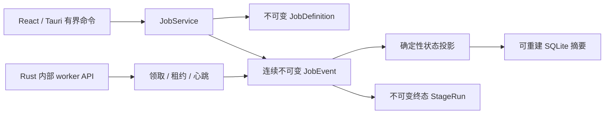
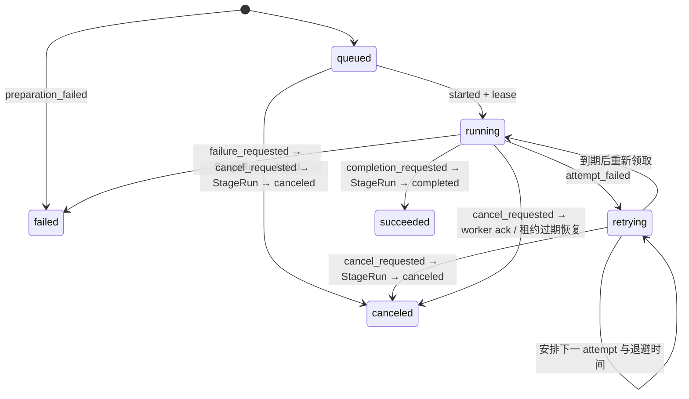
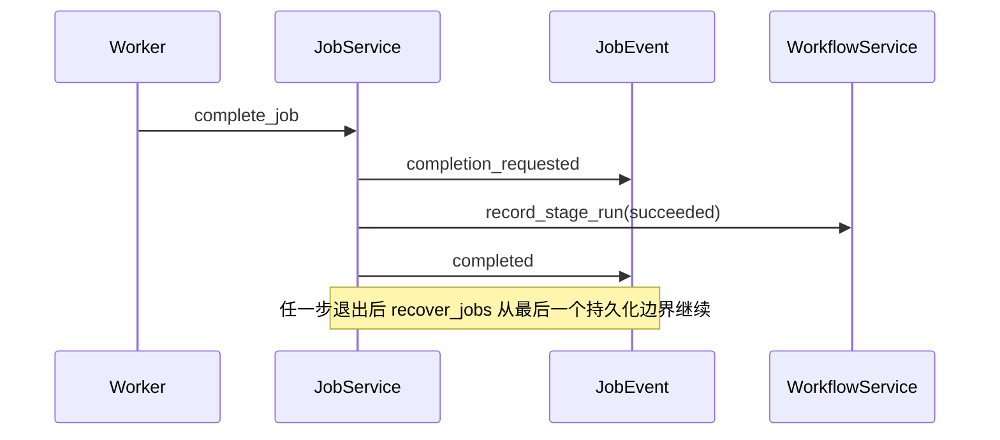

# 持久化任务队列

PR05 建立 NarraCut 的异步执行边界。核心原则是：**项目目录中的 `JobDefinition` 与
连续 `JobEvent` 是任务真相，SQLite 只是可删除、可重建的当前状态摘要。** 任务进程、桌面
窗口或本机索引异常退出，都不能把已发生的执行历史改写成另一种结果。



## 1. 项目内布局

```text
my-video/
  requests/
    jobs/
      job_<64-hex>.json
  jobs/
    job_<64-hex>/
      job.json
      events/
        0000000000.json
        0000000001.json
        ...
  cache/
    job-writes/
```

| 路径 | 角色 | 是否项目真相 |
| --- | --- | --- |
| `requests/jobs/<jobId>.json` | 可选的完整上层 enqueue receipt；在外部状态检查前原子绑定幂等身份 | 是 |
| `jobs/<jobId>/job.json` | 不可变 `JobDefinition`，绑定阶段、运行、输入、执行器、重试策略、哈希版本与可选 receipt 摘要 | 是 |
| `jobs/<jobId>/events/*.json` | 从 0 开始无缺口的不可变 `JobEvent` 流 | 是 |
| `cache/job-writes/` | 无覆盖提交前的同项目临时文件 | 否，可清理 |
| SQLite `job_summaries` | UI 查询用的当前状态、attempt 与进度投影 | 否，可重建 |

临时文件不放在 `events/` 中，避免另一进程扫描时把尚未提交的文件误认为损坏事件。最终
文件使用 `persist_noclobber` 无覆盖提交；同一 sequence 被另一进程抢先占用时返回
`event_conflict`，不会替换获胜事件。

## 2. 入队与幂等

`enqueue_stage_job` 先对 `idempotencyKey` 计算 SHA-256，再结合当前 `projectId` 推导稳定
`jobId`。`requestHash` 覆盖：

| 不可变输入 | 说明 |
| --- | --- |
| `stageId + stageRunId` | 一个任务只执行一个明确阶段运行 |
| `inputRefs` | 已审核的 Artifact 或受控项目文档引用 |
| `executor` | Provider、版本、执行模式与可选模型 |
| `retryPolicy` | 最大尝试次数与指数退避上限 |
| 可选完整 enqueue receipt | Provider/模型、run/key、语言、token 上限等上层请求字段 |

`JobDefinition` 自身决定哈希语义，读取端不得根据旁路 receipt 是否存在来猜测算法：

| JobDefinition 形态 | 验证规则 |
| --- | --- |
| legacy：缺少 `requestHashVersion` | 始终按旧版阶段任务字段计算 `requestHash`；即使旁路存在错误 receipt，也不改变 Job 的读取、列表或恢复语义 |
| v2：`requestHashVersion: 2`，无 `requestReceiptHash` | 新建的普通任务明确声明不使用 receipt；旁路出现 receipt 会作为独立完整性错误报告，不会切换 requestHash 算法 |
| v2：同时存在 `requestReceiptHash` | `requestHash` 绑定 JobDefinition 内的 receipt 摘要；随后独立要求 `requests/jobs/<jobId>.json` 存在且内容哈希匹配 |

升级后若同一幂等键已对应 legacy Job，服务会在任何 receipt 写入前先按旧算法完整验证 Job，再从不可变
`StageExecutionSnapshot`、executor 与配置重建完整 Script enqueue 请求。只有请求逐字段一致且原始
`idempotencyKey` 的 SHA-256 匹配时，才允许无覆盖附加同内容 receipt；无法证明或 payload 不同均返回
`idempotency_conflict`。因此 exact 与 differing replay 并发时，错误 payload 在进入原子写步骤前就被拒绝。

相同幂等键和相同请求返回现有任务；相同幂等键绑定不同请求返回
`idempotency_conflict`。首次入队会通过 WorkflowService 写入不可变
`StageExecutionSnapshot`，然后追加 sequence 0 的 `queued` 事件。若进程在两者之间退出，
`recover_jobs` 会从已认领的定义幂等完成快照与首事件，不创建第二个运行。若快照准备因
阶段或项目语义错误失败，系统会追加 sequence 0 的终态 `preparation_failed`，使拒绝原因可被
`get_job`、`list_jobs` 和事件审计读取；单个坏任务不会隐藏在磁盘中或阻塞其他任务恢复。
尚未初始化、瞬时 I/O 或内部契约错误不会写成终态，而是保留无事件的已认领定义；同一
幂等请求或 `recover_jobs` 会在外部条件恢复后再次准备。

Provider 等需要在当前凭据或上游状态检查前解析幂等性的调用，可先使用原子 receipt。receipt
与 JobDefinition 分目录保存，因此 receipt-only 崩溃不会被通用 Job 扫描误判为半个 Job；一旦
StageExecutionSnapshot 已冻结，重放只消费 receipt 与快照，不依赖当前外部状态，也不改写全局阶段配置。

## 3. 状态机



| 约束 | 行为 |
| --- | --- |
| 状态来源 | 每次读取都从 `JobDefinition + JobEvent[]` 重放，不信任 SQLite |
| 事件序列 | 文件名、`sequence`、`jobId`、`stageRunId` 必须一致且连续 |
| 时间 | RFC 3339 时间不得倒退；租约到期必须晚于对应事件 |
| SQLite 时间 | 写入前统一为 UTC 固定 9 位小数，按文本索引保留纳秒顺序 |
| 进度 | 单次 attempt 内只能单调增加，范围为 `0..=1` |
| 终态 | `succeeded`、`failed`、`canceled` 不再追加执行事件 |
| Artifact | 成功提交的 Artifact 清单同时进入终态请求、任务投影与 StageRun |

自动重试仍属于同一个尚未终结的 StageRun。用户在失败或取消后点击“重试”时，必须提供
新的 `runId` 与幂等键，创建新的 `JobDefinition` 和 StageRun；旧终态历史保持不变。

## 4. worker 租约与并发

worker 能力只存在于 `narracut-core`，不注册为 Tauri 命令：

| 内部操作 | 作用 |
| --- | --- |
| `claim_next_job` | 按 `createdAt + jobId` 领取最早可运行任务，并原子追加 `started` |
| `renew_job_lease` | 追加 `heartbeat`；到期时间靠近“当前逻辑时间 + 租期”，且至少比旧租约晚 1ns |
| `report_job_progress` | 使用当前 `leaseId` 追加单调进度 |
| `record_job_artifact` | 记录 attempt 产生的 Artifact |
| `complete_job` / `fail_job` | 进入两阶段终态提交或可重试失败 |
| `acknowledge_cancellation` | worker 停止副作用后确认运行中取消 |

每个 worker 事件必须匹配当前 attempt 与 `leaseId`。租约过期后，旧 worker 的进度、产物或
终态提交都会返回 `lease_expired`；只有恢复流程可以把该 attempt 记录为
`worker_interrupted` 并重新排队或提交最终失败。两个独立服务并发领取同一任务时，只有
一个能无覆盖占用下一个 sequence。收到 `cancel_requested` 或进入终态提交后，续租和其他
开放态 heartbeat 都会被拒绝，避免失联 worker 无限推迟取消或终态恢复。

## 5. 重试与取消

一次可重试失败拆成两条事件：

```text
attempt_failed(current attempt, leaseId, error, logSummary)
  → retrying(next attempt, nextAttemptAt, error)
```

这样即使进程在两条事件之间退出，恢复流程仍能识别“尝试已经失败但退避尚未安排”的
状态。退避按 `initialBackoffMs × backoffMultiplier^(failedAttempt-1)` 计算，并受
`maxBackoffMs` 限制；最多 10 次尝试、单次退避最多 24 小时。

| 取消时机 | 处理 |
| --- | --- |
| `queued` / 已安排 `retrying` | 立即写终态 canceled StageRun 与事件 |
| `running` 且租约有效 | 先记录 `cancel_requested`，等待 worker 停止并确认 |
| `running` 且租约过期 | `recover_jobs` 代表失联 worker 完成取消 |
| 已进入成功/失败终态提交 | 拒绝取消，避免两种终态竞争 |

## 6. 两阶段终态与崩溃恢复

成功和最终失败先写 `completion_requested` / `failure_requested`，再调用 WorkflowService
幂等提交不可变 StageRun，最后写 `completed` / `failed`。取消同样先保留
`cancel_requested`，再提交 StageRun 与 `canceled`。`artifact_created` 与
`completion_requested` 写入不可变事件前，必须先通过 WorkflowService 对 Artifact 所属项目、
阶段、运行、内容文件和审核契约的预检；失败不会留下伪造产物事件或永久
`finalizationPending`。



`recover_jobs` 有界扫描最多 1024 个任务，并处理：

| 可恢复状态 | 动作 |
| --- | --- |
| 只有定义、没有事件 | 幂等冻结执行快照并补 `queued` |
| 准备语义失败 | 保留可查询的 `preparation_failed` 终态，继续扫描其他任务 |
| attempt 已失败、尚未安排退避 | 补下一 attempt 与 `nextAttemptAt` |
| 租约过期 | 记录中断，按策略重试或最终失败 |
| 终态请求已写、StageRun/终态事件未完成 | 幂等补齐两阶段提交 |
| SQLite 缺失或过期 | 从事件投影重新 upsert 摘要 |
| 复制项目中的源身份任务 | 只读索引为历史，不在新项目身份下恢复执行 |

## 7. Tauri 命令边界

`job-command v1` 只暴露产品需要的高层操作：

| command | 行为 |
| --- | --- |
| `enqueue_stage_job` | 冻结阶段执行并持久化入队 |
| `get_job` | 从项目真相读取一个任务投影 |
| `list_jobs` | 按状态有界查询，最多 200 条 |
| `list_job_events` | 分页读取不可变事件，单页最多 500 条 |
| `cancel_job` | 请求有原因的安全取消 |
| `retry_stage_job` | 从失败/取消任务创建新 run 与新 job |
| `recover_jobs` | 恢复崩溃边界并重建任务摘要 |

前端不能领取 worker 租约、伪造进度、直接追加事件，也不能提供 shell、FFmpeg 参数或任意
插件操作。所有请求、响应和结构化错误先通过生成的 `job-command v1` 类型与运行时 Schema；
嵌入的 JobDefinition/JobEvent 再通过持久化 v1 Schema 二次校验。

## 8. 当前同步上限

| 项目 | 上限 |
| --- | ---: |
| 单项目任务 | 1024 |
| 单任务事件 | 4096 |
| 单任务定义或事件 JSON | 16 MiB |
| 单任务输入引用 | 256 |
| 单次成功 Artifact | 256 |
| UI 任务列表 | 200 |
| UI 单页事件 | 500 |
| worker 租约 | 1 秒至 5 分钟 |

## 9. 验证

```powershell
pnpm test
pnpm typecheck
cargo test -p narracut-core --test job_service
cargo fmt --all -- --check
cargo clippy --workspace --all-targets -- -D warnings
```

测试覆盖幂等冲突、RFC 3339 同秒 FIFO 与独立服务原子领取、进度和 Artifact 预检、成功
两阶段恢复、排队/运行取消、取消后续租拒绝、密集 heartbeat 租约边界、指数退避、租约
过期、每次尝试日志、最大尝试最终失败、人工新运行重试、准备失败隔离、首事件缺失恢复，
以及 TypeScript/Rust/Tauri 三层命令契约。
