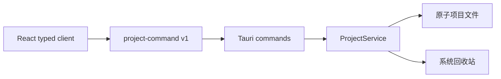
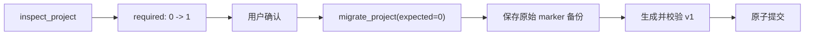

# 项目服务

项目服务是 NarraCut 的本地项目边界。React 不直接读写文件或拼接 shell 命令；所有
项目操作都经过版本化 command 契约、Tauri 适配器与 Rust 核心服务。



## 1. 当前能力

| 操作 | command | 行为 |
| --- | --- | --- |
| 检查 | `inspect_project` | 识别格式版本并返回当前、需迁移或更高版本状态，不隐式改写项目 |
| 打开 | `open_project` | 校验当前 v1 项目并返回项目描述；旧格式必须先显式迁移 |
| 新建 | `create_project` | 在同一父目录创建临时项目，完整写入后一次性提交 |
| 迁移 | `migrate_project` | 校验预期源版本、保存原始标识文件备份，再原子写入 v1 |
| 重命名 | `rename_project` | 只修改项目显示名和更新时间，不移动项目目录 |
| 复制 | `copy_project` | 创建新项目 ID、重写受控 JSON 中的项目引用并忽略缓存内容 |
| 归档 | `set_project_archived` | 更新项目元数据；取消归档时移除 `archivedAt` |
| 移入回收站 | `move_project_to_trash` | 二次核对 `expectedProjectId` 后调用操作系统回收站 |

TypeScript 客户端位于 `apps/desktop/src/lib/project-commands.ts`，Rust command 适配器位于
`apps/desktop/src-tauri/src/project_commands.rs`。Tauri 先接收原始 JSON envelope，经完整
Schema 校验并反序列化为当前操作对应的生成类型后，才进入核心服务；错误版本、错误
command 和字段类型错误都返回结构化 `invalid_request`。请求、响应与错误统一遵循
`packages/contracts/schema/narracut-project-commands-v1.schema.json`。

## 2. 项目目录

新项目创建以下标准目录：

```text
my-video/
  narracut.project.json
  sources/
  contracts/
  stages/
  runs/
  artifacts/
  assets/
  cache/
  exports/
  manifests/
  logs/
  backups/
    migrations/
```

`narracut.project.json` 是项目身份与格式版本的标识文件。`cache/` 可重建；迁移前的
原始标识文件保存在 `backups/migrations/`。

## 3. 文件安全边界

| 边界 | 当前保证 |
| --- | --- |
| 路径 | 只接受现有规范目录；项目目录、标识文件和复制树拒绝符号链接、Windows reparse point 与特殊文件 |
| 目录名 | 只接受单个目录名，拒绝 `.`、`..`、分隔符、首尾空白、尾随点及 Windows 保留名 |
| 标识文件 | 读取上限为 1 MiB，解析后必须通过当前 Project Schema 或受支持的旧格式校验 |
| 写入 | 标识 JSON 使用同目录原子写入；新建和复制先在同一父目录完成临时树，再重命名提交 |
| 迁移 | 调用方必须传入已检查的源格式版本；备份目录逐级创建并拒绝 symlink/reparse point，版本变化时返回 `migration_conflict` |
| 删除 | 不直接递归删除项目；校验项目身份和路径后移入系统回收站 |
| 并发 | 当前进程内的项目操作串行化，避免两个写操作交错修改同一项目 |

所有失败都返回 `ProjectCommandError`，包含稳定的 `code`、`operation`、消息以及可选的
路径和版本信息。UI 不需要解析 Rust 或操作系统错误字符串来决定处理方式。

## 4. 显式迁移

当前实现一条 `project-v0-to-v1` 迁移路径：



- `open_project` 不会替用户静默迁移。
- 已是当前版本、确认后版本发生变化或没有迁移路径时均拒绝执行。
- 高于当前支持版本的项目可以被检查，但不能打开或修改，防止旧客户端降级覆盖。

## 5. 复制边界

当前复制是有界的短任务，Tauri 通过 blocking worker 执行，避免阻塞异步运行时：

| 项目 | 规则 |
| --- | --- |
| 大小上限 | 64 MiB |
| 文件数上限 | 2048 |
| 文件系统条目上限 | 4096（文件与目录合计） |
| 目录深度上限 | 64 |
| 单个可重绑定 StageConfig 上限 | 16 MiB |
| 缓存 | 保留空 `cache/`，不复制缓存内容 |
| 新项目身份 | marker 生成新 `projectId`，仅重绑定可编辑 StageConfig 的顶层 `projectId`；配置业务载荷中的同名字段不递归改写 |
| 不可变历史 | StageRun、Artifact、ReviewRecord 与 manifest 保持原始字节和源 `projectId`，避免破坏 hash、幂等键与证据链 |
| 当前采用状态 | marker 中各阶段重置为 `draft` 并解除运行采用关系；继承历史可查看，但不会冒充新项目的当前结果 |
| 复制来源 | marker 保存 `copiedFromProjectId` / `copiedAt`；响应返回 `historyPolicy: preserve_immutable_source_identity` |
| 提交 | 先构建同级临时目录，全部成功后再重命名为目标目录 |

扫描使用有界迭代过程，在文件、字节、条目或深度首次超限时返回 `copy_too_large`，
不会先收集完整目录树，也不会开始部分复制。大型复制、可取消进度和重试由 PR05 的
持久化任务队列接管。

复制是“新项目继承源项目不可变历史”，不是伪造历史归属。旧运行仍如实表明自己由
源项目生成；新项目后续产生的运行使用新 `projectId`。各阶段回到 `draft`，当前可编辑
StageConfig 被显式重绑定，已有运行中的 `configSnapshot` 及其 `configHash` 保持不变。

## 6. 暂不包含

| 能力 | 计划边界 |
| --- | --- |
| 最近项目与搜索索引 | PR03 SQLite 数据层 |
| 目录选择器与项目首页 | PR06 产品界面 |
| 长任务的取消、进度、重试与幂等 | PR05 任务队列 |
| Artifact 内容寻址与大文件去重 | 后续 Artifact Store PR |

## 7. 验证

```powershell
pnpm test
pnpm typecheck
cargo fmt --all -- --check
cargo clippy --workspace --all-targets -- -D warnings
```

测试覆盖项目新建、打开、显示名修改、归档、可编辑配置重绑定、不可变历史逐字节保留、
显式迁移与备份、未来版本保护、回收站身份核验、畸形 command、超大标识文件、复制
文件/字节/条目/深度上限，以及可创建平台上的标识与迁移目录符号链接拒绝。
