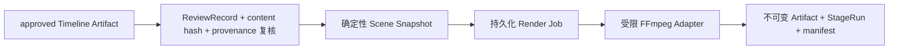

# Renderer v1

Renderer v1 把 NarraCut 的已审核 Timeline 变成可重放、可取消、可追踪的场景或全片 MP4，仍然遵守“工作台而非一次性成片生成器”的边界。渲染不会从原始资料重新总结，也不会静默替换旧运行。

## 输入闭包



正式渲染只接受 `timeline` 阶段当前 `approvedRunId` 指向的成功运行，并同时闭合：

| 检查 | 失败行为 |
| --- | --- |
| Project、StageRun、ReviewRecord、Artifact 属于同一工程和运行 | fail-closed，不创建 Render Job |
| ReviewRecord 为 `approved` 且明确包含 Timeline Artifact | 返回 `review_required` / `cross_project_reference` |
| Timeline 及其 Audio、Captions、Scene Plan、原始音频内容哈希复验通过 | 返回 `input_hash_mismatch` |
| `claim_id` 与 `evidence_ref` 追溯闭合 | 返回 `traceability_incomplete` |
| 画布、帧率、时长和编码配置位于 v1 上限内 | 返回 `invalid_request` / `resource_limit_exceeded` |

## 命令与能力边界

权威契约是 `packages/contracts/schema/narracut-renderer-v1.schema.json`。桌面端只暴露五个有类型的 Tauri commands：

| Command | 作用 | 是否创建历史 |
| --- | --- | --- |
| `probe_renderer` | 探测受支持的 FFmpeg 身份与固定能力 | 否 |
| `create_scene_snapshot` | 为一个已批准场景创建只读预览快照 | 否 |
| `enqueue_scene_render` | 创建单场景持久化 Job | 是 |
| `enqueue_timeline_render` | 创建全片持久化 Job | 是 |
| `get_render_result` | 读取成功 Job 的不可变 RenderResult | 否 |

前端不能提供或读取 FFmpeg 绝对路径，不能提供 argv、filter graph、环境变量、工作目录或输出路径。编码器固定为 `libx264` / `aac` / `yuv420p`，只允许选择有限 preset 与 CRF。浏览器演示模式不会调用本机能力，也不会伪造成功产物。

## Scene Snapshot

Snapshot 由 Timeline 与 Scene Plan 的结构化字段确定性生成，包含场景边界、标题、叙事角色、字幕 cue、权威 `provenance[{claimId,evidenceRef}]` 对、画布和安全区。`claimIds` / `evidenceRefs` 只是证据对的有序唯一投影，因此一对多和多对一追溯不会被错误拒绝或丢失。相同输入得到相同 HTML 与内容哈希。

- CSP 固定为默认拒绝，禁止 script、network、form、base 和 frame ancestor。
- 当前 v1 仅接受内建内容以及受控的 `narracut://project/...` 资源 URI；不接受 `http:`、`file:` 或任意本地路径。
- UI 使用无权限 `sandbox` iframe 的 `srcDoc` 展示快照，不授予脚本、同源、弹窗或导航能力。
- Snapshot 是预览与审计输入；事实证据仍来自上游 claim/evidence，不来自生成画面。
- 单场景 Snapshot、视频与日志只提交目标场景的 provenance；全片产物按目标场景顺序去重聚合，不能继承整条 Timeline 的无关证据。

## FFmpeg Adapter 与进程安全

当前 Windows Adapter 从系统 `PATH` 发现普通文件 `ffmpeg.exe`，并只接受同目录普通文件 `ffprobe.exe`；要求 FFmpeg major 6–8 且具备 `libx264`、`aac`。入队时冻结以下身份，执行、恢复和重试前重新核验：

- Adapter ID / 版本；
- canonical executable 文件名、内容 SHA-256 与版本；
- ffprobe 的 canonical 文件名、内容 SHA-256 与版本；
- 固定能力集合的 SHA-256。

身份变化会以 `renderer_identity_changed` 终止旧 Job，不会静默改用新二进制。版本探测、编码能力探测、正式 FFmpeg 和输出 ffprobe 都通过 `processkit` 的 Windows Job Object 执行，并具备独立超时、流式输出上限以及 `kill_all` + 进程终止屏障。每个 Job 只在工程内 `renders/.tmp/render-job-*` 使用受控临时目录，拒绝符号链接和越界 canonical path；候选 MP4 必须由冻结 ffprobe 复核容器、H.264/AAC、画布、帧率和实际时长后才进入 Artifact Store，任何损坏或参数漂移均 fail-closed。

## Job、恢复与不可变结果

Render Job 使用统一 Job Service 的 receipt、租约、进度、事件、取消、退避重试与启动恢复。并发上限当前固定为 1。显式重试创建新的 `run_id`，但保留原请求中的 Timeline、配置和 Renderer 身份，因此不会覆盖或漂移原历史。

成功运行提交：

| kind | media type | 内容 |
| --- | --- | --- |
| `scene_snapshot` | `text/html` | 每个受影响场景的确定性快照 |
| `rendered_scene` | `video/mp4` | 单场景 H.264/AAC 候选 |
| `rendered_video` | `video/mp4` | 全片 H.264/AAC 候选 |
| `render_log` | `application/json` | Renderer 身份、输入、配置、Snapshot hashes、Artifact manifest、影响场景与日志摘要 |

Artifact 均为内容寻址、不可覆盖的派生产物。首次 Artifact 写入前，Storage 会持久化与 `job_id` 绑定的 commit journal、稳定 Artifact ID 和 `createdAt`；进程中断后按同一计划幂等恢复，不生成重复身份。用户同步导入仍限制为 64 MiB，而持久化 Renderer Job 使用冻结 `maxTemporaryBytes` 流式提交，且绝不超过 Renderer v1 的 20 GiB 上限。大文件复制、哈希、`fsync`、CAS 首次无覆盖提交和碰撞后的完整去重校验全部运行在 project operation lock 外；短临界区只复验项目、Artifact draft、引用和已验证文件身份，再写入 metadata，因此并发 Job 仍可读取状态和续租。异步 supervisor 每秒检查取消与租约身份、每 60 秒续租，并按有界字节间隔报告提交进度。取消或租约丢失会在下一个流式检查点安全中止，保留 pending journal 供恢复。

全部 Artifact 持久化后，journal 仍保持 `pending`。Job 的 `completion_requested` 与 `cancel_requested` 通过同一不可覆盖事件序列竞争，前者是唯一成功提交点：取消先赢时 Job 进入 canceled 且 journal 保持 pending；成功先赢时 Artifact 会直接绑定 Job 和 `render` StageRun，后续取消不能改写终态，随后 journal 才标记 completed。若进程恰好在 Job 成功后、journal 更新前退出，启动恢复会把已成功 Job 的 journal 幂等收敛为 completed。局部场景渲染会明确记录 `affectedSceneIds`，不会声称未渲染场景被更新。

全片 Renderer v1 最多接受 254 个场景。每个场景生成一个不可变 Snapshot，再加视频与 render log，合计最多 256 个 Artifact，与 Job/StageRun v1 的成功终态硬上限一致。第 255 个场景会在创建 Job 前被拒绝，不会先写入 257 个 Artifact 再进入不可完成状态。

## 本地验证

```powershell
pnpm --filter @narracut/contracts test
pnpm --filter @narracut/desktop test
pnpm --filter @narracut/desktop build
cargo clippy --workspace --all-targets -- -D warnings
cargo test --workspace
cargo test -p narracut-renderer real_ffmpeg_smoke -- --ignored --nocapture
```

最后一项通过真实 FFmpeg Adapter 生成双场景 MP4；生产路径自身会调用身份冻结且有界的 `ffprobe`，验证 H.264、AAC、640×360、帧率与实际时长。CI 默认忽略该测试，因为仓库不下载或捆绑 FFmpeg。

## 依赖与发行说明

FFmpeg 是可替换 Renderer Adapter 后面的外部运行时，不是仓库内分发物。本地开发机上检测到的 GPL build 只可用于本地验证；这不等于 NarraCut 获得捆绑、再分发或发布该二进制的许可。最终安装包是否捆绑 FFmpeg、选用何种 build、如何提供 source/notice，以及模型、字体和素材许可，必须在发行工作中单独完成合规决策。

当前 v1 用固定场景视觉验证可靠的渲染、组合与追溯主链；HTML 动效捕获、HyperFrames、更多 Renderer Adapter 和最终 Export manifest 属于后续版本，不能绕过本契约直接接入 UI 或 shell。
