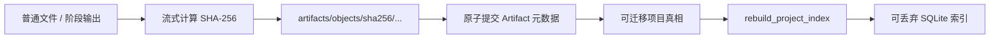

# Artifact Store 与本地索引

PR03 建立 NarraCut 的持久化产物边界。核心原则是：**项目目录保存真实内容与元数据，
SQLite 只保存可删除、可重建的查询索引。** 删除本机数据库不能导致项目历史或 Artifact
丢失。



## 1. 项目内布局

```text
my-video/
  artifacts/
    objects/
      sha256/
        ab/
          abcd...64-hex
    metadata/
      artifact_<uuid>.json
    .tmp/
  cache/
```

| 路径 | 角色 | 是否项目真相 |
| --- | --- | --- |
| `artifacts/objects/sha256/<前两位>/<64位哈希>` | 按内容寻址的不可变字节 | 是 |
| `artifacts/metadata/<artifactId>.json` | 完整 v1 `Artifact` 文档 | 是 |
| `artifacts/.tmp/` | 同项目文件系统中的导入临时文件 | 否，可恢复/清理 |
| `cache/` | 可重新生成的代理、缩略图和临时渲染结果 | 否 |

项目复制只保留空的 `artifacts/.tmp/` 与 `cache/` 目录，不复制其中内容；崩溃残留不会进入
副本、复制字节预算或项目真相。

`Artifact.uri` 必须等于其 `contentHash` 推导出的项目相对对象路径。读取和重建索引时会
再次核对这两个字段，元数据不能借 URI 指向项目外部或任意项目文件。

## 2. 提交顺序与失败语义

```text
校验项目身份与 ArtifactDraft
  → 检查源文件（普通文件、无链接、同步上限内）
  → 同项目临时文件中流式复制并计算 SHA-256
  → 复核源文件未在读取期间变化
  → 无覆盖地原子提交为内容寻址对象（已有对象先逐字节校验后去重）
  → 用持久化 v1 Schema 校验完整 Artifact
  → 原子提交 metadata JSON
  → 尝试更新 SQLite 索引
```

| 失败位置 | 可观察结果 | 恢复方式 |
| --- | --- | --- |
| 草稿、身份或源路径校验失败 | 不创建 Artifact 文件 | 修正输入后重试 |
| 临时复制失败 | 临时文件由守卫清理 | 重试 |
| 对象已存在但哈希/长度不符 | 返回 `content_corrupt`，不覆盖现有对象 | 人工恢复内容后校验 |
| 元数据提交失败 | 最多留下未引用的内容对象，不产生半份 Artifact 历史 | 重试；后续 GC 可回收孤儿对象 |
| SQLite 更新失败 | Artifact 仍提交成功，响应为 `indexStatus: rebuild_required` | 删除/修复数据库并重建索引 |

SQLite 的失败不能把已经提交的项目真相变回失败，也不能诱导调用方覆盖 Artifact 历史。

## 3. Artifact 草稿与完整契约

`ArtifactDraft` 只包含阶段、运行、种类、媒体类型、证据角色、来源与追溯关系。以下字段
只能由 Artifact Store 计算或生成：

| Store 负责字段 | 原因 |
| --- | --- |
| `artifactId` | 生成安全、不可猜测且可作为元数据文件名的身份 |
| `projectId` | 从当前已验证项目读取，不能由调用方伪造 |
| `uri` | 必须由内容哈希唯一推导 |
| `contentHash` / `byteLength` | 必须来自真实字节流 |
| `source.sourceContentHash`（导入素材） | 与 Store 实际读取的源字节哈希一致，不能由调用方声明 |
| `createdAt` | 由提交边界记录 |

生成素材的草稿不能声明 `factual_evidence`；导入素材草稿必须保留作者、许可证、署名和
授权记录，Store 在提交时写入真实来源哈希。完整文档在落盘前必须通过
`narracut-contracts-v1`。
Media 导入同时把每条授权持久化为项目内 `authorizations/<authorizationRecordId>.json`。
记录绑定 `projectId`、来源 SHA-256、授权人、范围、证据引用、记录时间、`material_use`
类型与 `granted` 状态；同 ID 仅允许完整内容相同的幂等重放，冲突内容拒绝覆盖。导出时必须
逐条解析这些记录，不能只相信 Artifact 中的字符串 ID。
读取和索引重建还会再次要求导入来源的 `sourceContentHash` 等于 Artifact 顶层
`contentHash`，元数据篡改不能悄悄进入查询索引。
派生草稿的 `sourceArtifactIds` 和生成草稿可选的 `promptArtifactId` 必须在当前项目目录中
解析到已提交且内容仍可用的 Artifact；Store 在创建临时文件前完成核对，断链引用不会
产生半份产物。单个派生产物最多引用 256 个来源。

Store 生成的身份固定为 `artifact_<32位小写十六进制 UUID>`；存储命令只接受以
`artifact_` 开头的可移植 ASCII 文件身份，从而避免 Windows 设备名和路径穿越语义。

## 4. SQLite 索引

桌面端把数据库放在 Tauri `app_local_data_dir/narracut-index.sqlite3`，当前
`PRAGMA user_version = 2`。连接启用外键、5 秒 busy timeout、WAL 与 `synchronous=NORMAL`。
程序会先读取并确认 `user_version`，再设置会持久化的 journal mode；旧客户端因此不会
改写未来版本数据库的模式或 Schema。

v1 → v2 迁移会保留 `recent_projects` 与 `artifacts`，只清空可由项目内
`JobDefinition + JobEvent` 重建的 `job_summaries`，并把时间排序索引升级为
`updated_at DESC, job_id ASC`。这样旧的变长 RFC 3339 摘要不会与固定 9 位 UTC 新数据混排；
启动恢复会重新投影任务摘要。

| 表 | 用途 | 重建来源 |
| --- | --- | --- |
| `recent_projects` | 最近打开项目、显示名、路径、归档状态 | 已验证 Project marker / 项目操作结果 |
| `artifacts` | 按项目、阶段、运行、哈希查询 Artifact | `artifacts/metadata/*.json` |
| `job_summaries` | 任务队列当前状态摘要 | 项目内 JobDefinition + JobEvent 的确定性投影 |

Artifact 索引同时保存：

- `owner_project_id`：当前物理项目目录的身份；
- `document_project_id`：不可变 Artifact 文档原本的项目身份。

复制项目后，这两个值可以不同。这样既能在副本中查询继承历史，又不会伪造历史产物归属。
`forget_project` 只删除索引记录，并通过外键级联清理 Artifact/任务摘要；不会删除项目目录。

## 5. 重建与损坏检测

`rebuild_project_index` 先完整扫描并校验元数据，全部成功后才在单个 SQLite 事务中替换该
项目的 Artifact 索引。同步重建最多处理 4096 个元数据文件且元数据合计不超过 64 MiB；
更大项目可复用持久化任务机制；Artifact 重建专用 job type 尚待后续适配。
扫描还会整体校验来源引用：目标必须存在、内容可用，且来源图不能形成循环；任一失败都
发生在 SQLite 事务开始前，旧索引快照保持不变。同步来源图校验最多处理 65,536 条边。

重建只检查内容对象是否存在，不复算大型媒体哈希：未被引用的缺失内容计入
`missingContentCount`，作为其他 Artifact 来源的缺失内容则会使来源图校验失败。用户或
QA 可以调用 `verify_artifact` 流式复算 SHA-256 与字节数，结果区分：

| 状态 | 含义 |
| --- | --- |
| `verified` | 哈希和长度均与元数据一致 |
| `missing_content` | 元数据存在，内容对象缺失 |
| `hash_mismatch` | 长度一致但内容哈希变化 |
| `byte_length_mismatch` | 内容长度变化 |

未来版本的 SQLite `user_version` 会返回 `index_migration_failed`，不会被旧客户端降级覆盖。

## 6. 缓存边界

`clean_project_cache` 必须同时核对 `expectedProjectId`，并且只处理项目根下的 `cache/`。
删除前会先完成有界扫描：最多 4096 个条目、256 MiB、64 层；遇到符号链接、Windows
重解析点、特殊文件或超限时，在删除任何条目前失败。项目真相目录、Artifact、源文件和
外部链接目标均不在清理范围内。

## 7. Tauri 命令

| command | 行为 |
| --- | --- |
| `import_artifact_file` | 从明确源文件提交一个新 Artifact |
| `get_artifact` | 读取并校验 Artifact 元数据，报告内容是否存在 |
| `verify_artifact` | 复算内容 SHA-256 与长度 |
| `rebuild_project_index` | 从项目目录事务性重建 Artifact/最近项目索引 |
| `list_recent_projects` | 查询最近项目，可选择是否包含已丢失路径 |
| `list_indexed_jobs` | 查询 JobService 持续更新、可从事件重建的任务摘要 |
| `forget_project` | 只移除本机索引记录 |
| `clean_project_cache` | 有界清理可重建缓存 |

Tauri 仍先接收原始 JSON，经 `storage-command v1` 和具体生成请求类型后才进入 DTO 与
blocking worker。前端不执行 SQLite、文件复制或 shell 命令。

## 8. 当前同步上限与后续边界

| 操作 | 当前上限 | 后续接管者 |
| --- | ---: | --- |
| 单文件 Artifact 导入或完整哈希校验 | 64 MiB | 基于持久化队列增加 Artifact job type |
| 项目 Artifact 重建 | 4096 条 / 元数据 64 MiB / 来源边 65,536 条 | 基于持久化队列增加后台扫描 job type |
| cache 清理 | 4096 条目 / 256 MiB / 64 层 | 基于持久化队列增加维护 job type |

当前实现不做引用计数 GC，不删除未引用的内容对象，也不把 SQLite 作为 StageRun、Artifact
或 JobEvent 的唯一存储位置。GC 与任务事件恢复必须在引用链和任务契约落地后实现。

## 9. 验证

```powershell
pnpm test
pnpm typecheck
cargo fmt --all -- --check
cargo clippy --workspace --all-targets -- -D warnings
```

测试覆盖内容寻址、去重、无覆盖提交、完整性与同步大小边界、无效草稿零写入、项目身份
核对、索引故障后项目真相保留、删除重建、失败重建保留旧快照、缺失/篡改内容、复制历史
双身份、任务摘要、外键级联、未来索引版本不被改写、缓存清理和可创建平台上的链接逃逸
拒绝。
