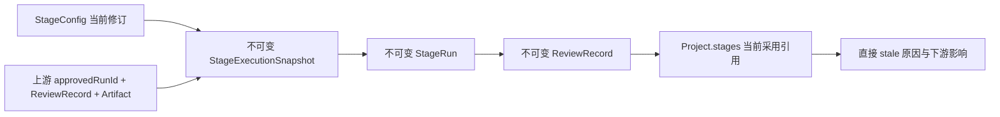
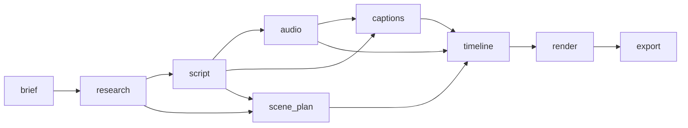

# 阶段工作流服务

PR04 建立 NarraCut 的“当前采用状态 + 不可变历史”边界。它负责阶段依赖、配置修订、
执行快照冻结、终态运行提交、人工/Agent 审核和 stale 传播；它不执行 AI、音频或渲染任务，
异步运行由持久化任务队列通过冻结快照、JobEvent 与 worker 租约编排，见
[job-service.md](job-service.md)。



## 1. 标准阶段图

当前只支持 `workflow_standard_v1`，共 9 个阶段：



初始化会验证阶段数量、唯一 ID、依赖存在性和无环性。阶段定义是不可变项目真相；已有
同路径文档只有内容完全一致才视为幂等重放，任何差异返回 `immutable_conflict`。

## 2. 项目内布局

```text
my-video/
  narracut.project.json             # 当前 stage state 与采用引用
  contracts/stages/<stage>.json     # 不可变 StageDefinition
  stages/<stage>/config.json        # 当前可编辑 StageConfig
  runs/reservations/<run>.json      # 按 runId 唯一的全项目原子预留快照
  runs/<stage>/<run>/execution.json # 执行开始时冻结的不可变快照
  runs/<stage>/<run>/run.json       # 不可变 StageRun
  runs/<stage>/<run>/reviews/
    <review>.json                    # 不可变 ReviewRecord
```

| 文档 | 写入策略 | 身份与冲突规则 |
| --- | --- | --- |
| `StageDefinition` | 无覆盖提交 | 同 stage 路径只接受逐字段一致的内置定义 |
| `StageConfig` | 同目录原子替换 | 调用方必须携带 `expectedRevision`，成功后修订号加一 |
| `StageExecutionSnapshot` | 全局预留后无覆盖提交 | `prepare_stage_run` 先按 runId 原子创建 `runs/reservations/<run>.json`，再物化逐阶段同内容快照；不同阶段或载荷不能同时取得同一 runId |
| `StageRun` | 无覆盖提交 | `runId` 由调用方分配；相同载荷为幂等重放，不同载荷为 `run_conflict` |
| `ReviewRecord` | 无覆盖提交 | `reviewId` 由调用方分配；相同载荷为幂等重放，不同载荷为 `review_conflict` |
| `Project.stages` | 原子替换 | 只保存当前 `approvedRunId`、`latestRunId`、状态和直接 stale 原因 |

所有路径组件都使用可移植 ASCII 身份，并逐级拒绝符号链接、Windows reparse point、
非目录中间组件和项目根外路径。单个 JSON 同步读取上限为 16 MiB。
`runId` 与 `reviewId` 在整个项目内保持唯一。runId 的公共预留路径只由 runId 决定，使用
跨服务实例、跨进程均不覆盖的原子提交；阶段快照缺失时，同请求可从预留快照恢复。依赖型 Artifact 输入还必须同时绑定
`sourceRunId`、`reviewRecordId`、`artifactId`、真实 `contentHash` 和 kind；仅提供文本 ID
不能建立批准链路。

## 3. 状态与 stale 语义

阶段状态不是单独的执行历史，而是从当前配置、采用运行和上游采用引用推导的视图：

| 条件 | 当前状态 |
| --- | --- |
| 无采用运行且上游未全部可用 | `draft` |
| 无采用运行且上游全部可用 | `ready` |
| 最新成功运行尚未审核 | `needs_review` |
| 采用运行匹配当前配置与所有上游采用版本 | `approved` |
| 已有采用运行，但配置 hash 或上游采用版本不匹配 | `stale` |
| 无采用运行且最新运行失败 | `failed` |

`staleBecauseStageIds` 只记录直接原因。若 `brief` 更新使 `research` 失效，再使 `script`
失效，则 `research` 记录 `brief`，`script` 记录 `research`；UI 不需要解析一条扁平的全链路
原因。阶段自身配置变化用自身 `stageId` 表示直接原因。

一个阶段可以保留可用的旧 `approvedRunId`，同时让更新的 `latestRunId` 处于
`needs_review`。下游仍引用明确的旧采用版本，不会因候选运行出现而被静默切换。
若执行期间配置或上游采用版本变化，终态仍会按冻结快照写入历史，响应中的
`executionOutdated: true` 明确提示该候选已过期；首次批准仍会被拒绝。

## 4. 提交与失败顺序

| 操作 | 顺序 | 崩溃/重试语义 |
| --- | --- | --- |
| 修改配置 | 先把当前采用链标为 stale，再原子写新配置 | 配置写失败最多留下安全的“假阳性 stale”；按旧修订重试可恢复 |
| 开始运行 | 完成输入/批准链校验后，先原子取得全局 runId 预留，再无覆盖写 `execution.json` | 并发阶段只能有一个取得 runId；预留成功后崩溃可由同请求恢复，配置或上游随后变化不会篡改快照 |
| 提交运行 | 先无覆盖写 `run.json`，再更新 marker | marker 写失败后用同一 `runId` 重试会识别原运行并补齐当前引用 |
| 提交审核 | 先无覆盖写审核，再更新 marker | 重试不会复制审核；旧审核重放不会覆盖时间上更晚的审核 |

批准只接受 `succeeded` 运行。阶段第一次批准时，候选运行必须仍匹配当前配置和全部上游
采用版本；已有采用版本后，用户可以显式选择历史运行作为回退，但如果它不再匹配当前
输入，结果会清楚显示为 `stale`，不会伪装成新鲜批准。

成功 StageRun 必须至少包含一个 Artifact。每个输出都必须已在 Artifact Store 提交，属于
同一项目、阶段和 `runId`，kind 位于该阶段 `outputKinds`，且内容对象仍可用。审核记录只能
选择 StageRun 不可变产物清单中的 Artifact，不能在运行完成后注入新产物。

`InputReference` 是判别联合：`artifact` 引用必须命中当前有效批准的 StageRun 与
ReviewRecord 产物清单；`project_document` 只解析 `project://` 项目内普通文件，逐级拒绝
链接和路径穿越，并流式复算 SHA-256。所有输入 kind 必须属于当前阶段 `inputKinds`。

## 5. Tauri 命令

| command | 同步行为 |
| --- | --- |
| `initialize_project_workflow` | 安装或幂等确认标准阶段图与初始配置 |
| `get_project_workflow` | 返回定义、当前状态与当前配置快照 |
| `update_stage_config` | 乐观修订配置并传播 stale |
| `prepare_stage_run` | 在可信后端冻结执行时输入、配置、执行器和幂等键 |
| `record_stage_run` | 只消费既有执行快照，提交终态、不可变 StageRun |
| `review_stage_run` | 提交审核并采用、拒绝或请求修改 |
| `preview_regeneration` | 无副作用计算变更阶段及全部下游影响 |
| `list_stage_history` | 按时间倒序读取最多 100 个运行及其审核 |

所有请求、响应和错误先通过 `workflow-command v1`。响应内嵌的 StageDefinition、
StageConfig、StageExecutionSnapshot、StageRun 与 ReviewRecord 还会通过持久化 v1 Schema 二次校验。前端的类型化
调用封装位于 `apps/desktop/src/lib/workflow-commands.ts`。

同步历史扫描最多处理单阶段 1024 个运行和 1024 条审核；超过后返回
`scan_limit_exceeded`，由未来长任务边界接管。

## 6. 验证

```powershell
pnpm test
pnpm typecheck
cargo test -p narracut-core --test workflow_service
cargo clippy --workspace --all-targets -- -D warnings
```

集成测试覆盖初始化幂等、复制后 DAG 重建、图环检测、执行期间配置/上游变化、失败与取消
历史落盘、运行/审核不可变冲突、批准产物与 kind 绑定、运行后 Artifact 注入拒绝、首次过期
批准拒绝、显式历史回退、旧审核重放、直接 stale 传播、1024/1025 审核边界与无副作用影响预览。
